# Link REIT Membership System / 領展會員系統

A comprehensive membership and stamp (印花) management system for Link REIT's commercial properties in Hong Kong. The system supports multi-tenant operation across the group–project–merchant hierarchy, with trilingual interfaces (繁體中文 / 简体中文 / English) and multiple client platforms.

## Screenshots

### Customer H5 App (顧客端)

| Home | Stamps | Scan | Offers | Profile |
|------|--------|------|--------|---------|
| 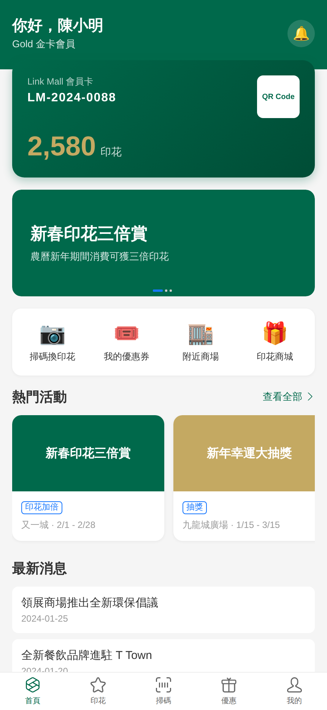 | 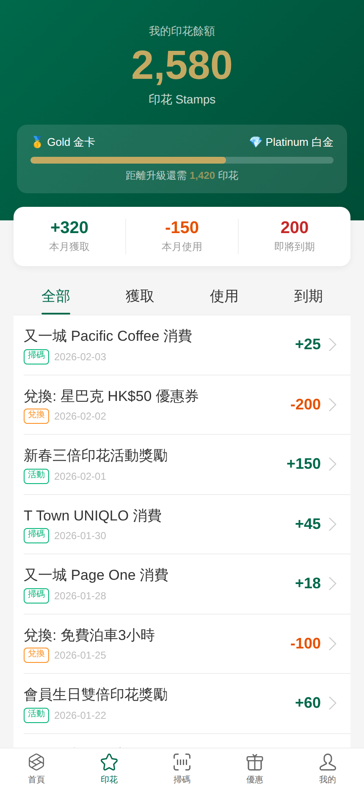 | 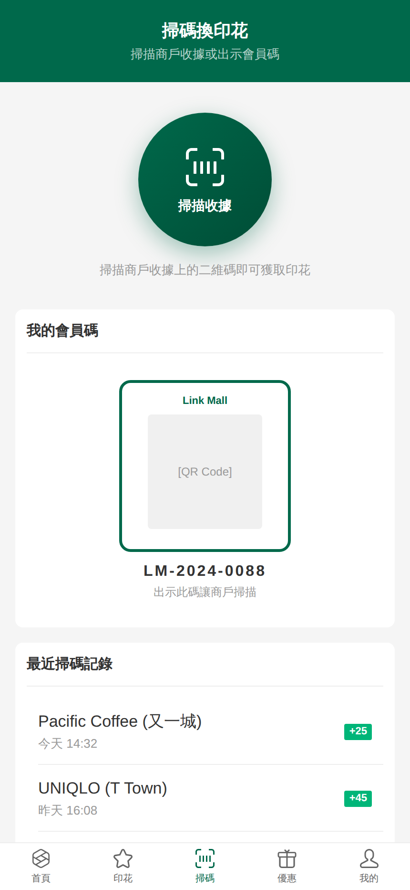 | 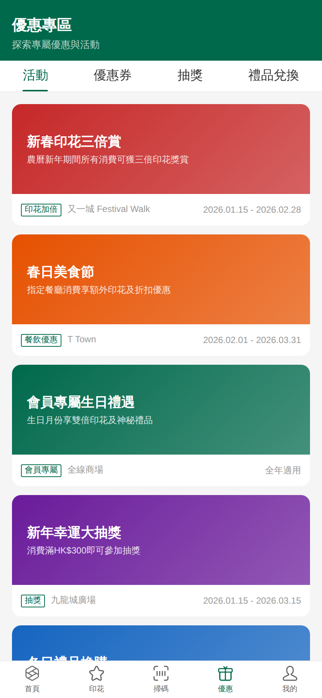 | 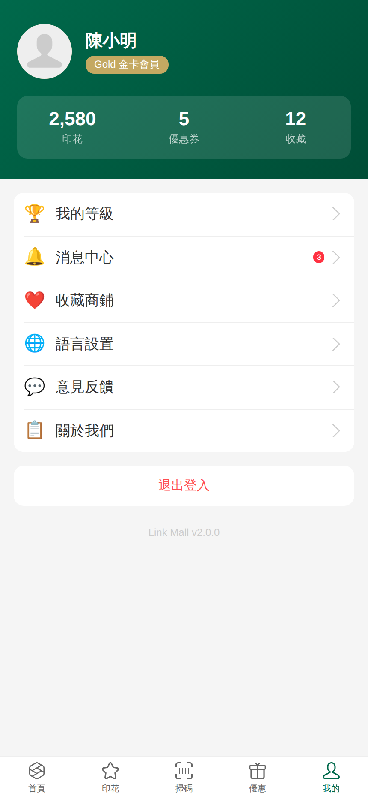 |

| Tier System | Settings | Mall Directory | Merchant Detail |
|-------------|----------|----------------|-----------------|
| 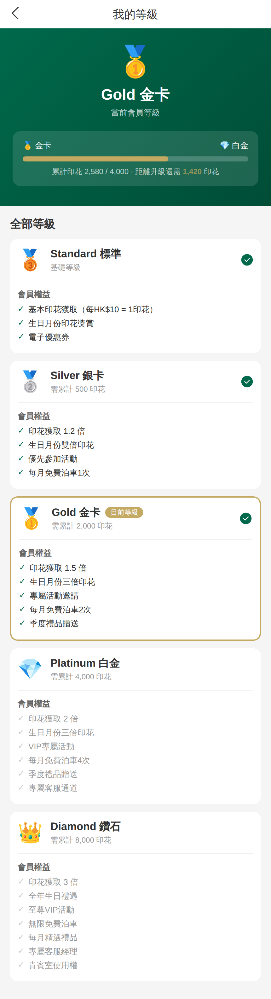 | 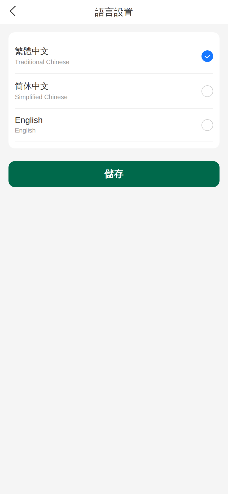 | 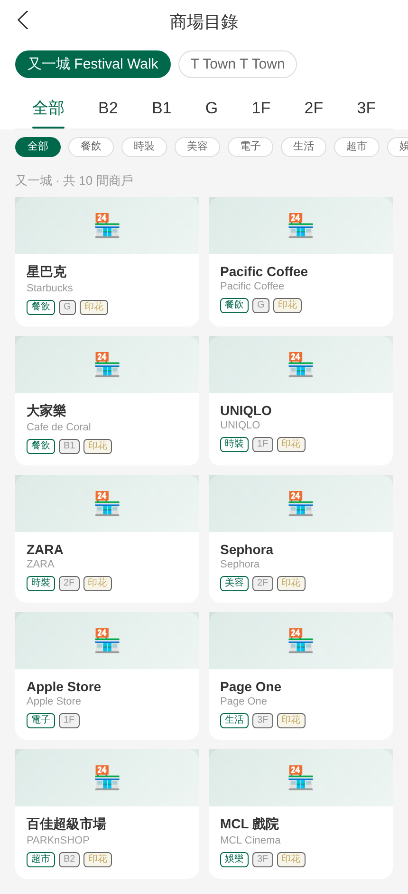 | 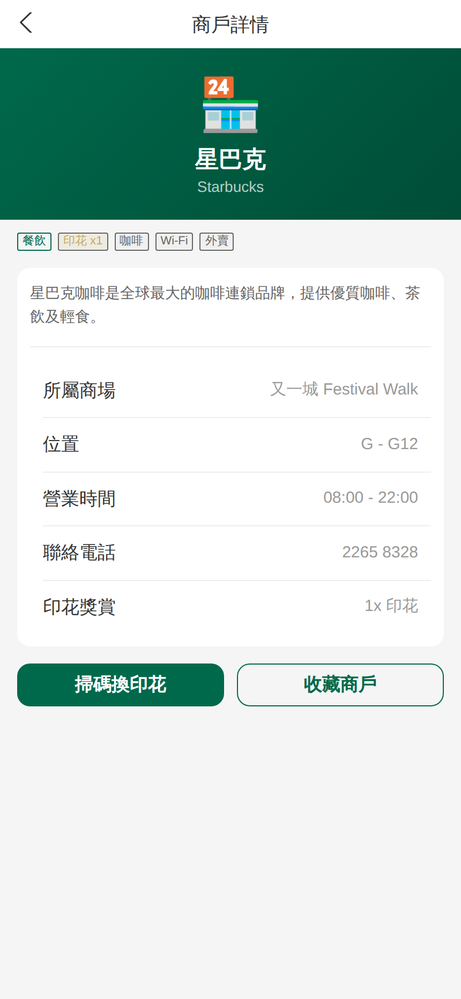 |

### Admin Portals (管理後台)

| Group Admin Login | Mall Admin Login | Merchant Portal Login |
|-------------------|------------------|-----------------------|
| 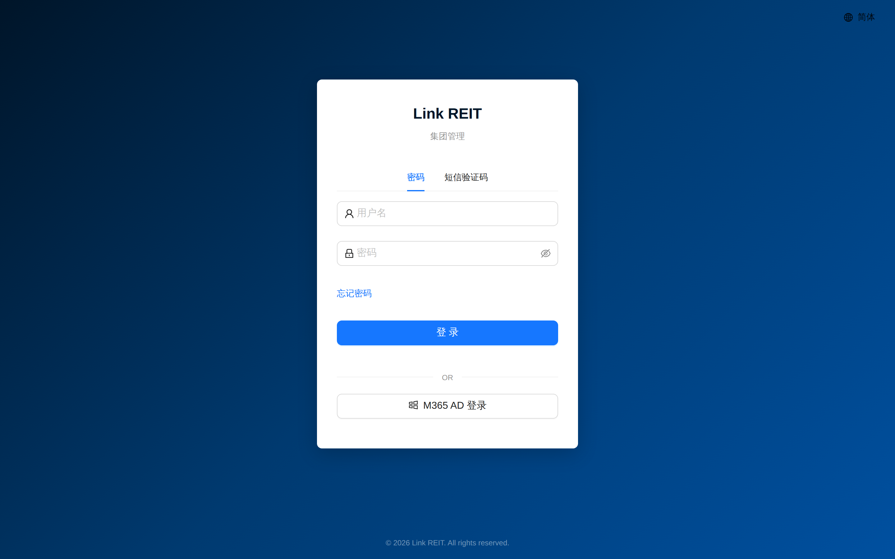 | 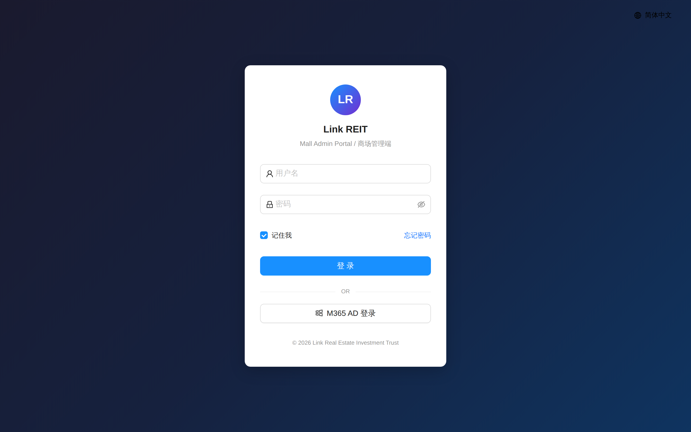 | 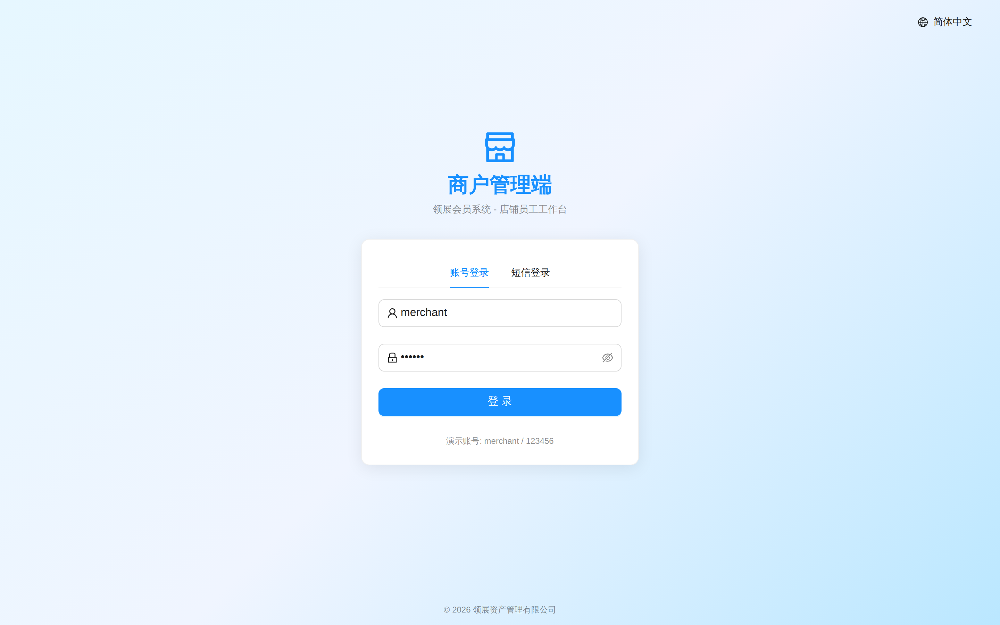 |

| Group Admin Dashboard | Merchant Portal Dashboard | API Docs |
|-----------------------|---------------------------|----------|
| 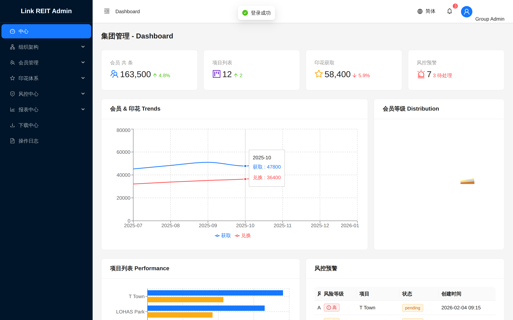 | 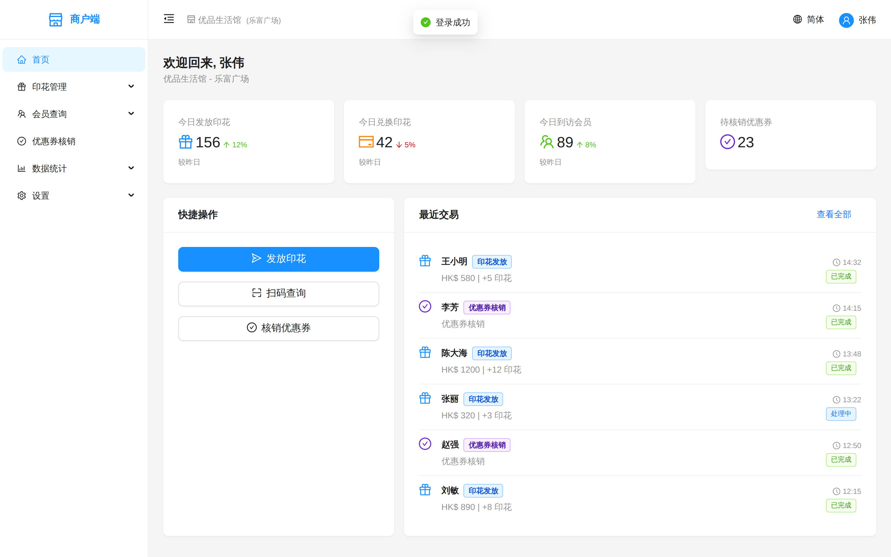 | 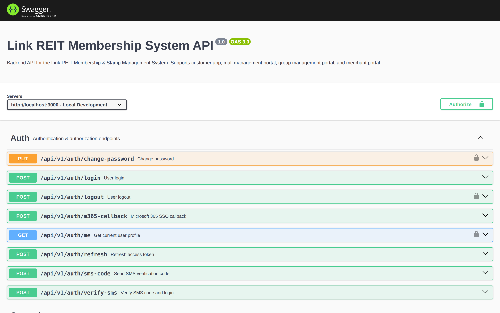 |

## Features

### Stamp (印花) System
- Stamp earning rules: per-transaction, multiplier, tiered, campaign-based
- Stamp consumption: coupon redemption, gift exchange, parking
- Expiry management: rolling / fixed-date / no-expiry policies
- Upper limit controls and campaign-specific bonus rules
- Full transaction audit trail with anomaly detection

### Member Management
- 5-tier membership: Standard → Silver → Gold → Platinum → Diamond
- Multi-channel registration: App, Website, Counter, Kiosk, WeChat Mini Program
- Member card lifecycle: issuance, replacement, suspension, merge
- Labelling & segmentation with auto-tagging engine
- Import / export with Excel templates

### Smart Marketing
- Event-driven trigger engine (purchase, birthday, tier change, inactivity)
- Auto-tag rules with real-time member classification
- Member journey builder with multi-step workflows
- A/B testing for campaign variant optimization
- Member segmentation with RFM analysis

### Risk Control Center
- Real-time stamp anomaly detection (velocity, amount, frequency)
- Abnormal member behaviour review with configurable thresholds
- Whitelist / blacklist management
- Rule engine with customisable risk scoring
- Manual review workflow with approval chain

### Content Management
- Campaign management with multi-channel distribution
- Coupon system (electronic coupons, verification, usage tracking)
- Lucky draw with prize pool and probability management
- Banner / article / push notification publishing
- Venue & floor plan directory

### Multi-Platform Support
| Platform | Technology | Directory |
|----------|-----------|-----------|
| Backend API | NestJS + Prisma + PostgreSQL | `apps/backend` |
| Group Admin (集團端) | React + Ant Design | `apps/group-admin` |
| Mall Admin (商場端) | React + Ant Design | `apps/mall-admin` |
| Merchant Portal (商戶端) | React + Ant Design | `apps/merchant-portal` |
| Customer H5 (顧客端 Web) | React + antd-mobile | `apps/customer-web` |
| Customer Mobile | React Native (Expo) | `apps/customer-mobile` |
| WeChat Mini Program | uni-app + Vue 3 | `apps/mini-program` |

## Tech Stack

| Layer | Technology |
|-------|-----------|
| Backend Framework | NestJS 10 |
| ORM / Database | Prisma 5 + PostgreSQL 16 |
| Cache / Queue | Redis 7 + Bull |
| Authentication | JWT + M365 AD SSO + SMS OTP |
| Admin UI | React 18 + Ant Design 5 |
| Mobile Web UI | React 18 + antd-mobile 5 |
| Native Mobile | React Native + Expo |
| Mini Program | uni-app + Vue 3 |
| Build System | Turborepo + pnpm Workspaces |
| Containerisation | Docker Compose + Nginx |
| Language | TypeScript 5 (全栈) |

## Project Structure

```
link-reit-membership/
├── apps/
│   ├── backend/               # NestJS API server
│   │   ├── prisma/            #   Schema (47 tables) & seed data
│   │   └── src/
│   │       ├── modules/       #   Feature modules (10)
│   │       ├── common/        #   Shared guards, filters, interceptors
│   │       └── config/        #   Environment config loader
│   ├── group-admin/           # Group admin portal (29 pages)
│   ├── mall-admin/            # Mall admin portal (26 pages)
│   ├── merchant-portal/       # Merchant portal (11 pages)
│   ├── customer-web/          # Customer H5 web app (12 pages)
│   ├── customer-mobile/       # React Native mobile app
│   └── mini-program/          # WeChat mini program
├── packages/
│   └── shared/
│       ├── types/             # TypeScript type definitions (14 files)
│       ├── i18n/              # Trilingual translations (zh-CN, zh-TW, en)
│       ├── utils/             # Crypto, format, pagination, validation
│       └── api-client/        # Axios-based API client
├── docker-compose.yml         # Full production stack
├── turbo.json                 # Turborepo pipeline config
├── pnpm-workspace.yaml        # Workspace definitions
└── docs/                      # Documentation
    ├── architecture.md        # System architecture
    ├── api.md                 # API reference
    ├── deployment.md          # Deployment guide
    └── development.md         # Developer guide
```

## Quick Start

### Prerequisites

- Node.js >= 18.0.0
- pnpm >= 8.0.0
- PostgreSQL 16
- Redis 7

### Installation

```bash
# Clone repository
git clone <repo-url>
cd link-reit-membership

# Install dependencies
pnpm install

# Copy environment config
cp .env.example apps/backend/.env

# Set up database
pnpm db:migrate
pnpm db:seed

# Start all services in development mode
pnpm dev:backend        # API on http://localhost:3000
pnpm dev:group-admin    # Group admin on http://localhost:3001
pnpm dev:mall-admin     # Mall admin on http://localhost:3002
pnpm dev:merchant-portal # Merchant portal on http://localhost:3003
```

### Docker Deployment

```bash
docker-compose up -d
```

This starts PostgreSQL, Redis, the backend API, all admin portals, and an Nginx reverse proxy.

See [docs/deployment.md](docs/deployment.md) for full deployment instructions.

## Documentation

| Document | Description |
|----------|-------------|
| [Architecture](docs/architecture.md) | System architecture, data model, module design |
| [API Reference](docs/api.md) | REST API endpoints, auth, request/response formats |
| [Deployment Guide](docs/deployment.md) | Docker, Nginx, environment configuration, production checklist |
| [Development Guide](docs/development.md) | Local setup, coding conventions, project scripts, testing |

## Database Schema

The system uses **47 database tables** organised into these domains:

- **Organisation**: Group, OrganizationUnit, Project
- **Users & Auth**: User, Role, Permission, UserRole, LoginLog, AuditLog
- **Members**: Member, MemberCard, MemberTier, MemberLabel, MemberChangeRecord, MemberAccountRecord, SpecialListMember
- **Stamp Engine**: StampAccount, StampTransaction, StampEarningRule, StampConsumptionRule, StampExpiryRule, StampUpperLimitRule, CampaignStampRule, OnlineActivityStampRule, StampInfo
- **Merchants**: Merchant, MerchantAccount
- **Campaigns**: Campaign, Coupon, CouponInstance, LuckyDraw, LuckyDrawPrize, LuckyDrawEntry, Gift, GiftRedemption
- **Content**: Venue, FloorPlan, ContentArticle, ServiceDirectory, Banner
- **Notifications**: PushNotification, NotificationTemplate, SmsSendRecord
- **Operations**: InterfaceMonitor, ReportDownload, OperationLog

## Demo Accounts

| Portal | Username | Password |
|--------|----------|----------|
| Group Admin | admin@linkgroup.com | admin123 |
| Mall Admin | admin@festivalwalk.com | admin123 |
| Merchant Portal | merchant@starbucks.com | merchant123 |
| Customer H5 | Auto-login demo user (陳小明, Gold tier) | — |

## API Documentation

Interactive Swagger UI is available at `http://localhost:3000/api/docs` when the backend is running.

## License

Proprietary - Link Real Estate Investment Trust © 2026
